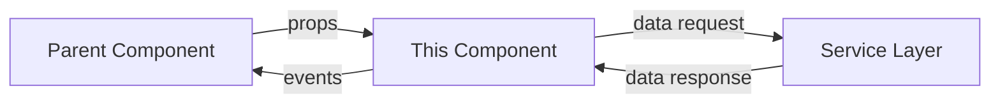
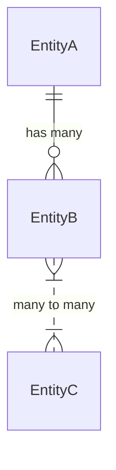
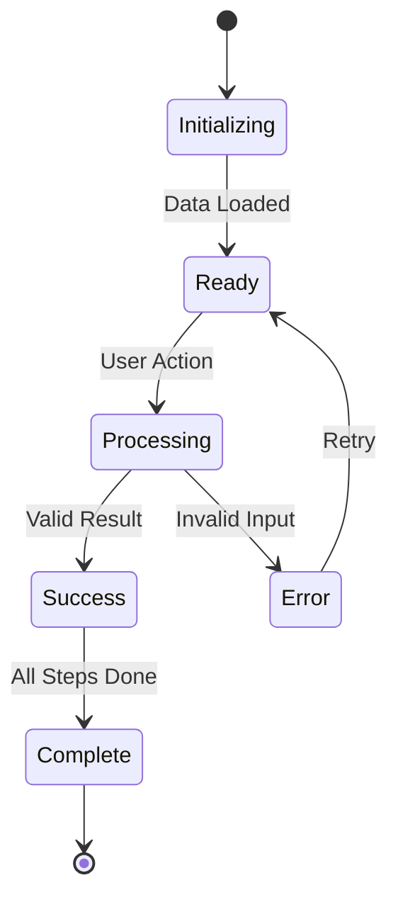
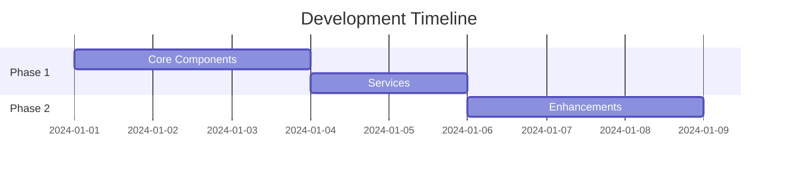

# User Journey Stage Breakdown Analysis

## 1. Optimal Breakdown Approach Analysis

### Recommendation: Hybrid Per-Stage User Journey with Embedded Functional Requirements
After analyzing your documentation pipeline and goals, the most effective approach is **Per-Stage User Journeys with Progressive Functional Requirement Integration**. Here's why:

**Per-Stage User Stories** alone are too high-level and lack the technical specificity needed for coding agents. They describe the "what" but not the "how" in sufficient detail.

**Per-Stage Functional Requirements** alone skip important context about user flow, emotional states, and decision points that inform implementation decisions.

**Optimal Approach - Hybrid Model:**
- Start with user journey context (preserves user experience flow)
- Embed functional requirements within each journey step
- Include technical implementation hints without prescribing solutions
- Maintain traceability from user action → system response → technical requirement

This hybrid approach provides:
- **Context** for why features exist (user journey)
- **Specification** of what must be built (functional requirements)
- **Guidance** on how to implement (technical notes)
- **Validation** criteria for testing (acceptance criteria)

## 2. Section Carry-Over Strategy

### Recommended Section Structure for Per-Stage Files

**Sections to Include (Modified per Stage):**
1. **Stage Context Summary** (NEW - replaces broad overview sections)
   - Stage purpose within overall journey
   - Entry/exit criteria from previous/next stages
   - Key personas active in this stage
   - Stage-specific success metrics

2. **Active Personas for Stage** (MODIFIED from original)
   - Only personas relevant to this stage
   - Their specific goals within this stage
   - Pain points addressed in this stage
   - Success criteria from their perspective

3. **Stage Value Proposition** (MODIFIED from original)
   - Specific value delivered in this stage
   - How it builds on previous stages
   - What it enables in future stages
   - Proof-of-concept demonstration points

**Sections to Exclude:**
- Overall journey scope (too broad for stage-specific work)
- Complete persona definitions (include only relevant details)
- Full success definition (focus on stage-specific metrics)

**New Sections to Add:**
1. **Data State Management**
   - What data enters this stage
   - What data is created/modified
   - What data exits to next stage
   - State validation requirements

2. **Component Architecture Map**
   - UI components needed
   - Service layer requirements
   - Data layer interactions
   - External integrations

3. **Implementation Sequence**
   - Build order within the stage
   - Dependencies between features
   - Progressive enhancement points
   - Testing checkpoints

## 3. Documentation Path Optimization

### Current Path Analysis:
```
Overview → User Stories → User Journey → Wireframes → Functional Requirements → Coding Tasks
```

### Optimized Path with Sub-Steps:
```
1. Overview
   ↓
2. User Stories
   ↓
3. User Journey (Full Product)
   ↓
4. **Stage-Specific Journey Breakdowns** (NEW)
   ├── 4.1 Stage Context & Setup
   ├── 4.2 Detailed User Flows
   ├── 4.3 Component Requirements
   └── 4.4 Technical Specifications
   ↓
5. **Interactive Wireframes** (ENHANCED)
   ├── 5.1 Component Library Definition
   ├── 5.2 State Diagrams
   ├── 5.3 User Flow Animations
   └── 5.4 Error State Designs
   ↓
6. **Granular Functional Requirements** (ENHANCED)
   ├── 6.1 Component-Level FRs
   ├── 6.2 Service-Level FRs
   ├── 6.3 Data-Level FRs
   └── 6.4 Integration FRs
   ↓
7. **Atomic Coding Tasks** (ENHANCED)
   ├── 7.1 Setup & Configuration Tasks
   ├── 7.2 Component Development Tasks
   ├── 7.3 Service Implementation Tasks
   ├── 7.4 Integration Tasks
   └── 7.5 Testing & Validation Tasks
```

### Key Additions:
- **Stage-Specific Breakdowns** bridge the gap between high-level journey and detailed requirements
- **Sub-categorization** at each level provides better organization for coding agents
- **Progressive Detail** ensures each level adds specificity without losing context

## 4. Additional Optimization Considerations

### For Maximum Coding Agent Effectiveness:

**1. Explicit State Machines**
- Define every possible state for each component
- Map all state transitions with triggers
- Include edge cases and error states
- Specify state persistence requirements

**2. Data Flow Diagrams**
- Input → Processing → Output for every feature
- Validation rules at each step
- Error handling pathways
- Performance constraints

**3. Component Interaction Maps**
- Parent-child relationships
- Event propagation paths
- Shared state management
- Communication protocols

**4. Implementation Hints Without Prescribing**
- Suggest design patterns (e.g., "Consider Observer pattern for real-time updates")
- Reference similar implementations (e.g., "Similar to Dropbox's file upload UX")
- Note performance considerations (e.g., "Optimize for <100ms response")
- Include accessibility requirements

**5. Testing Scenarios as Requirements**
- Unit test scenarios embedded in component specs
- Integration test points between components
- E2E test flows for critical paths
- Performance benchmarks

**6. Progressive Enhancement Markers**
- Core functionality (must have)
- Enhanced features (should have)
- Delightful additions (nice to have)
- Future considerations (could have)

### Documentation Quality Metrics:
- **Granularity Score**: Can a developer implement without asking questions?
- **Completeness Score**: Are all states, errors, and edge cases covered?
- **Testability Score**: Can QA write comprehensive tests from the spec?
- **Traceability Score**: Can you trace from user need to code implementation?

## 5. Stage-Specific Documentation Principles

### Each Stage Document Should:

**1. Stand Alone Yet Connect**
- Complete enough to develop independently
- Clear interfaces to adjacent stages
- Explicit dependencies noted
- Shared components identified

**2. Progress from Why to How**
- Start with user value (why build this)
- Define user experience (what they see/do)
- Specify system behavior (what happens)
- Include implementation guidance (how to build)

**3. Include Three Levels of Detail**
- **Executive Summary**: One paragraph stage overview
- **User Level**: Complete user flows and interactions
- **Developer Level**: Technical specifications and requirements

**4. Provide Multiple Perspectives**
- User's view (experience and flow)
- System's view (processing and logic)
- Data's view (transformations and storage)
- Tester's view (validation and verification)

**5. Enable Parallel Development**
- Clear API contracts between components
- Stub/mock data specifications
- Integration points well-defined
- Dependencies explicitly stated

---

# Per-Stage User Journey Breakdown Template

## Template for Stage-Specific User Journey Documentation

```markdown
# Bright Run LoRA Training Data Platform - Stage [#]: [Stage Name] Detailed Breakdown
**Version:** 1.0.0  
**Date:** [MM-DD-YYYY]  
**Stage Number:** [#]
**Stage Identifier:** [Short identifier, e.g., "discovery", "ingestion", etc.]
**Development Priority:** [Critical/High/Medium/Low]
**Estimated Development Effort:** [X story points or Y days]

**Parent Documents:**
- Full User Journey: `pmc/product/03.5-bmo-user-journey.md`
- Product Overview: `pmc/product/01-bmo-overview.md`
- User Stories: `pmc/product/02-bmo-user-stories.md`

## Stage Executive Summary

### Stage Mission Statement
[One sentence describing the core purpose of this stage in the user's journey]

### Stage Value Proposition
- **Immediate Value**: [What users gain upon completing this stage]
- **Progressive Value**: [How this stage enhances previous stages]
- **Future Enablement**: [What this stage makes possible in later stages]
- **Proof-of-Concept Contribution**: [How this proves the product concept]

### Stage Success Metrics
- **Primary Success Metric**: [Main measurable outcome]
- **Quality Metrics**: [Accuracy, consistency, reliability measures]
- **Performance Metrics**: [Speed, efficiency, throughput measures]
- **User Satisfaction Metrics**: [Engagement, completion, satisfaction measures]

## Stage Context

### Position in Overall Journey
```
[Previous Stage] → THIS STAGE → [Next Stage]
        ↑                              ↓
   [Entry State]                [Exit State]
```

### Stage Dependencies
**Requires from Previous Stage:**
- [Specific data/state requirement 1]
- [Specific data/state requirement 2]

**Provides to Next Stage:**
- [Output/state provided 1]
- [Output/state provided 2]

**External Dependencies:**
- [API, service, or system requirement]
- [Third-party integration requirement]

### Active User Personas

#### Primary Persona: [Persona Name]
- **Stage-Specific Goal**: [What they want to achieve in this stage]
- **Entry Knowledge State**: [What they know/have when entering]
- **Success Criteria**: [What defines success for them]
- **Potential Friction Points**: [Where they might struggle]
- **Required Support**: [Help, tooltips, guidance needed]

#### Secondary Persona: [Persona Name]
[Same structure as primary]

## Detailed User Flows

### Flow [#.1]: [Primary Flow Name]

#### Flow Overview
- **Purpose**: [Why this flow exists]
- **Trigger**: [What initiates this flow]
- **Outcome**: [What is accomplished]
- **Average Duration**: [Expected time to complete]

#### Pre-Flow State
```yaml
user_state:
  knowledge: [what user knows]
  confidence: [low/medium/high]
  data_available: [what they have]
system_state:
  components_loaded: [list]
  data_processed: [list]
  services_ready: [list]
```

#### Step-by-Step Flow

##### Step [#.1.1]: [Step Name]
**User Intention**: [What the user wants to do]
**User Action**: [Specific action taken]

**System Response**:
```yaml
immediate_response:
  - [Visual feedback]
  - [State change]
  - [Data validation]
background_processing:
  - [Async operation]
  - [Data preparation]
error_handling:
  - condition: [Error condition]
    response: [How system handles it]
    user_message: [What user sees]
```

**Technical Requirements**:
```yaml
components:
  - name: [Component name]
    type: [Component type]
    responsibilities:
      - [Responsibility 1]
      - [Responsibility 2]
services:
  - name: [Service name]
    operation: [What it does]
    input: [Expected input]
    output: [Expected output]
data:
  - entity: [Data entity]
    operations: [CRUD operations needed]
    validation: [Validation rules]
```

**Acceptance Criteria**:
```gherkin
Feature: [Step Feature Name]
  
  Scenario: Successful [Action]
    Given [initial state]
    When [user action]
    Then [expected outcome]
    And [additional outcome]
    
  Scenario: Error Handling
    Given [initial state]
    When [error condition]
    Then [error handling]
    And [user guidance]
```

**Implementation Notes**:
- **Design Pattern**: [Suggested pattern]
- **Performance Target**: [Specific metric]
- **Accessibility**: [WCAG requirement]
- **State Management**: [How state is handled]

[Repeat for each step in the flow]

#### Post-Flow State
```yaml
user_state:
  knowledge_gained: [what user learned]
  confidence: [updated level]
  data_created: [what they produced]
system_state:
  data_persisted: [what was saved]
  state_updated: [what changed]
  ready_for_next: [next stage readiness]
```

### Flow [#.2]: [Secondary Flow Name]
[Repeat structure for each flow in the stage]

## Component Architecture

### UI Components Required

#### Component: [Component Name]
```typescript
interface [ComponentName]Props {
  // Required props
  [propName]: [type]; // [description]
  
  // Optional props  
  [propName]?: [type]; // [description]
  
  // Event handlers
  [onEvent]: (param: [type]) => void; // [when triggered]
}

interface [ComponentName]State {
  [stateProperty]: [type]; // [purpose]
}
```

**Component Responsibilities**:
- [Specific responsibility 1]
- [Specific responsibility 2]

**Component Interactions**:


**Validation Rules**:
- [Field]: [Validation rule and error message]
- [Field]: [Validation rule and error message]

### Service Layer Requirements

#### Service: [Service Name]
```typescript
interface [ServiceName] {
  // Core operations
  [methodName](param: [type]): Promise<[ReturnType]>;
  
  // Error handling
  handleError(error: [ErrorType]): [ErrorResponse];
  
  // State management
  updateState(state: [StateType]): void;
}
```

**Service Responsibilities**:
- [Data processing responsibility]
- [Business logic responsibility]
- [Integration responsibility]

**API Contracts**:
```yaml
endpoint: /api/[endpoint]
method: [GET/POST/PUT/DELETE]
request:
  headers:
    [header]: [value]
  body:
    [field]: [type] # [description]
response:
  success:
    status: [200/201/204]
    body:
      [field]: [type]
  error:
    status: [400/401/403/404/500]
    body:
      error: [error message]
      details: [additional info]
```

### Data Layer Specifications

#### Data Entity: [Entity Name]
```typescript
interface [EntityName] {
  id: string;
  [field]: [type]; // [constraints]
  createdAt: Date;
  updatedAt: Date;
}
```

**Data Operations**:
- **Create**: [Validation and process]
- **Read**: [Query patterns and optimization]
- **Update**: [Allowed updates and triggers]
- **Delete**: [Cascading effects and cleanup]

**Data Relationships**:


## State Management

### Stage State Machine


### State Transitions
| Current State | Trigger | Next State | Side Effects |
|--------------|---------|------------|--------------|
| [State] | [User action or system event] | [New state] | [What happens] |

### State Persistence
```yaml
session_storage:
  - [temporary data]
  - [UI state]
local_storage:
  - [user preferences]
  - [cached data]
server_storage:
  - [permanent data]
  - [user progress]
```

## Error Handling & Edge Cases

### Error Scenarios

#### Error Type: [Error Category]
**Trigger Conditions**: [What causes this error]
**Detection Method**: [How system identifies it]
**User Experience**: [What user sees/experiences]
**Recovery Path**: [How user can proceed]
**Prevention Strategy**: [How to avoid this error]

### Edge Cases

#### Edge Case: [Scenario Name]
**Description**: [Unusual but possible scenario]
**Probability**: [Low/Medium/High]
**Impact**: [Minor/Major/Critical]
**Handling Strategy**: [How system handles it]
**Testing Approach**: [How to test for it]

## Performance Requirements

### Performance Targets
| Operation | Target | Degraded | Unacceptable |
|-----------|--------|----------|--------------|
| [Operation name] | <[X]ms | [X-Y]ms | >[Y]ms |

### Optimization Strategies
- **[Strategy Name]**: [Description and implementation]
- **[Strategy Name]**: [Description and implementation]

### Load Handling
```yaml
expected_load:
  concurrent_users: [number]
  requests_per_second: [number]
  data_volume: [size]
scaling_strategy:
  - [Approach 1]
  - [Approach 2]
```

## Testing Strategy

### Unit Tests
```typescript
describe('[Component/Service Name]', () => {
  it('should [expected behavior]', () => {
    // Arrange
    [setup]
    // Act
    [action]
    // Assert
    [expectation]
  });
});
```

### Integration Tests
- **Test Case**: [Integration scenario]
  - **Components**: [What's being integrated]
  - **Expected Result**: [What should happen]
  - **Edge Cases**: [Boundary conditions]

### E2E Tests
```gherkin
Feature: [Stage Feature]
  Background:
    Given [common setup]
    
  Scenario: Complete [Stage] Successfully
    When [user completes all steps]
    Then [expected final state]
    
  Scenario: Abandon [Stage] Midway
    When [user leaves incomplete]
    Then [state is preserved]
    And [user can resume]
```

## Implementation Sequence

### Development Phases

#### Phase 1: Foundation (Core Functionality)
**Duration**: [X days]
**Dependencies**: None
**Deliverables**:
1. [Core component 1]
2. [Core service 1]
3. [Basic data structure]

**Definition of Done**:
- [ ] Unit tests pass
- [ ] Basic happy path works
- [ ] Error handling implemented

#### Phase 2: Enhancement (Additional Features)
**Duration**: [Y days]
**Dependencies**: Phase 1 complete
**Deliverables**:
1. [Enhanced feature 1]
2. [Optimization 1]

[Continue for each phase]

### Critical Path


## Quality Assurance Checklist

### Pre-Implementation Review
- [ ] All user stories mapped to flows
- [ ] All flows have complete acceptance criteria
- [ ] Technical requirements are unambiguous
- [ ] Dependencies are identified and available
- [ ] Performance targets are realistic

### Implementation Checklist
- [ ] Code follows established patterns
- [ ] All states handled explicitly
- [ ] Error messages are user-friendly
- [ ] Accessibility standards met (WCAG 2.1 AA)
- [ ] Performance targets achieved

### Post-Implementation Validation
- [ ] All acceptance criteria pass
- [ ] Edge cases handled gracefully
- [ ] Performance meets targets under load
- [ ] User feedback incorporated
- [ ] Documentation updated

## Next Steps & Handoffs

### Handoff to Next Stage
**Data Package**:
```yaml
required_output:
  - [data element 1]: [format and validation]
  - [data element 2]: [format and validation]
state_requirements:
  - [state element 1]: [expected value/range]
  - [state element 2]: [expected value/range]
```

### Integration Points
- **Previous Stage Interface**: [How this stage receives from previous]
- **Next Stage Interface**: [How this stage provides to next]
- **External Interfaces**: [Any external system integrations]

### Known Limitations
- [Limitation 1]: [Impact and workaround]
- [Limitation 2]: [Impact and workaround]

### Future Enhancements
- [Enhancement 1]: [Value and implementation approach]
- [Enhancement 2]: [Value and implementation approach]

## Appendices

### A. Glossary
| Term | Definition | Context |
|------|------------|---------|
| [Term] | [Plain English definition] | [When/where used] |

### B. References
- [Reference 1]: [URL or document path]
- [Reference 2]: [URL or document path]

### C. Example Data
```json
{
  "exampleInput": {
    "field1": "value1",
    "field2": "value2"
  },
  "exampleOutput": {
    "field1": "processedValue1",
    "field2": "processedValue2"
  }
}
```

### D. Component Library Mappings
| Required Feature | Suggested Component | Alternative | Notes |
|-----------------|--------------------|-----------------------|-------|
| [Feature] | [Library component] | [Alternative option] | [Considerations] |

## Document Metadata
- **Last Updated**: [Date]
- **Updated By**: [Author]
- **Review Status**: [Draft/In Review/Approved]
- **Next Review Date**: [Date]
```

---

## Usage Instructions for Stage Breakdown Template

### How to Use This Template:

1. **For Each Stage in the User Journey**:
   - Create a separate document using this template
   - Fill in all sections with stage-specific details
   - Maintain consistency in terminology and structure

2. **Level of Detail Guidelines**:
   - **User Flows**: Include every click, every decision, every system response
   - **Technical Requirements**: Specific enough that a developer doesn't need clarification
   - **Acceptance Criteria**: Detailed enough that QA can write comprehensive tests
   - **Error Handling**: Cover every possible failure mode

3. **Cross-References**:
   - Link to parent documents for context
   - Reference specific US#.#.# from user stories
   - Note dependencies on other stages
   - Include component reuse opportunities

4. **Progressive Elaboration**:
   - Start with high-level flows
   - Add technical details iteratively
   - Incorporate feedback from development team
   - Update based on implementation learnings

5. **Quality Checks**:
   - Can a new developer understand what to build?
   - Can QA write tests without asking questions?
   - Are all edge cases and errors addressed?
   - Is the "why" clear for every "what"?

This template optimizes for:
- **Granularity**: Every detail needed for implementation
- **Context**: Understanding why features exist
- **Testability**: Clear criteria for validation
- **Maintainability**: Easy to update and extend
- **Parallelization**: Teams can work independently
